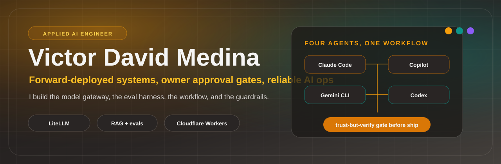

# Victor David Medina

**AI / Forward-Deployed Engineer | USMC veteran**

 

I build AI systems that propose actions and wait for owner approval before they run: multi-agent orchestration, LLM gateways, RAG, and evaluation harnesses gated in CI.

2.5 years building software and AI systems. Open to AI Engineer, Forward-Deployed, and Applied AI roles, contract or full-time. Watertown, MA, remote (US) or Boston metro. v.davidmedina@gmail.com

## Start here

- **[llm-eval-harness](https://github.com/Victor-David-Medina/llm-eval-harness)**, my clearest proof: a deterministic LLM evaluation gate that fails CI when answer quality regresses. Pure standard-library Python, readable in one sitting, green CI badge. Grounding, faithfulness, relevance, and keyword checks scored into one composite with tiered regression detection.
- **CouncilVerse**, my open-source multi-agent council engine on npm ([@relaylaunch](https://www.npmjs.com/org/relaylaunch)): structured council modes and quality-weighted voting.
- **[aws-terraform-portfolio](https://github.com/Victor-David-Medina/aws-terraform-portfolio)**: multi-AZ AWS VPC, GuardDuty, tfsec in CI, six Terraform modules, S3-native state locking, and an operational runbook.

## What I work in

- **AI and LLM:** multi-agent orchestration, LiteLLM gateway routing 15 cloud models across 7 providers, RAG on Qdrant and pgvector, MCP, LLM evaluation (golden datasets, regression detection, grounding and faithfulness), tracing with Langfuse.
- **Edge and backend:** Cloudflare Workers (D1, KV, R2, Queues), Supabase (PostgreSQL with Row-Level Security), Hono, Node.
- **Full-stack:** Next.js, React, Astro, Tailwind, TypeScript.
- **Cloud and DevOps:** AWS (EC2, S3, IAM, VPC, GuardDuty), Terraform (S3-native state locking, tfsec in CI), Docker, GitHub Actions, Prometheus, Grafana.
- **Languages:** Python, TypeScript, SQL, Bash, PowerShell.

## Current project

Building a deployed AI operations system for small service businesses: a Cloudflare Workers execution engine with per-tenant isolation, a LiteLLM gateway with RAG and a CI-gated eval harness, and owner-approved autonomy. The AI prepares each action; the owner approves it before anything runs.

Solo and pre-revenue, dogfooded on my own company plus two early unpaid pilots, a spa and an auto shop. Any impact figure is a projected target, not a measured result, until a pilot measures one.

## Track record

Eight years across enterprise operations, accounting systems, and software QA before AI engineering, with measured outcomes from prior roles:

- **ezCater:** led a 1,000+ user Expensify rollout (NetSuite and Namely integration, UAT) to 100% adoption in 90 days.
- **Orchestra.so (QA, contract):** caught 50+ defects and drove about 30% faster fix turnaround.
- **Blue Matter Consulting:** recovered $11K+ in vendor overcharges through root-cause analysis.

Reliability-first by training: I design failure modes, escalation paths, and incident response in from the start.

## Background

U.S. Marine Corps veteran (2013-2017), then operations and QA, now AI engineering. QA Engineering Certificate (Careerist, 2024).

## Contact

- Email: v.davidmedina@gmail.com
- LinkedIn: https://www.linkedin.com/in/victor-david-medina
- Website: https://relaylaunch.com (the production system behind the work above)
